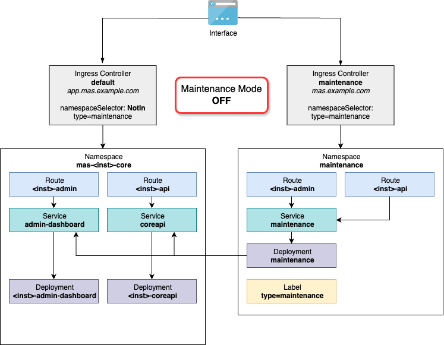

# Maintenance Mode for IBM MAS
This repository contains example implementation of the maintenance mode for IBM Maximo Application Suite.  
When maintenance mode is **ON** then static content is served while accessing MAS services.  

This tool can be used during service windows when either MAS services should not be accessed by the end users in order not to interfere with maintenance activities and/or to gracefully handle MAS services unavailability, caused by downtimes (e.g. during MAS Manage `updatedb` execution). 

Static content served to the end users can be customized by modifying [`maintenance.html`](maintenance.html) file content (see example below). It's important though to notice that at this point configuration supports single-page HTML files, with all images and styles embedded, which size does not exceed 1MB. In case of a need to serve more sophisticated content it might be required to build dedicated maintenance deployment image. Alternatively, since under the hood maintenance deployment is fully functional *nginx*, then all other configuration techniques can be employed to adjust the behavior, e.g. automatic redirect to an externally managed SharePoint/Teams site, etc. For the list of all available options refer to [the official nginx documentation](https://nginx.org/en/docs/).


By default maintenance mode configuration activates for all end users **except of** ones whitelisted explicitly by IP in [`default.conf`](default.conf) file (ref. `bypass` map). This effectively allows for certain users to maintain regular MAS behavior, regardless of whether maintenance mode is **ON** or **OFF**. The tool automatically whitelists all worker nodes' IPs. This is required in order to allow cross-node communication when PODs are referring to each other using routes (e.g. MAS Manage OIDC cookie validation). Additional maintenance mode bypass matching rules can be added by updating [default.conf](default.conf) file. Changes will be re-applied every time maintenance mode is activated.

## Scope
This tool currently supports MAS Core and Manage but can easily be extended to handle other MAS components.

## Implementation Details


The solution consists of following configurations:
* Create new ingress controller (**maintenance**) handling all routes in the namespaces labeled with `type=maintenance` (ref. `.spec.namespaceSelector`). 
* Update the **default** ingress controller by excluding all routes which are to be handled by the **maintenance** ingress controller (ref. [Sharding the default Ingress Controller](https://community.ibm.com/community/user/asset-facilities/discussion/Sharding%20the%20default%20Ingress%20Controller)). 
* Configure new **maintenance** namespace, service and deployment (acting as a reverse proxy) which are meant to handle user traffic during the service window, when maintenance mode is **ON**. 
* Generate clones of MAS Core, MAS Manage, etc. routes (a.k.a. *maintenance routes*) and repoint `.spec.to.name` and `.spec.to.targetPort` to the service created in previous step.
* Label newly created **maintenance** namespace with `type=maintenance`.

Once everything is in place Maintenance Mode can be:
* **Enabled** by labeling original MAS Core, MAS Manage namespaces with `type=maintenance` and removing `type=maintenance` label from **maintenance** namespace.
* **Disabled** by doing the opposite of **Enable**.

### Additional Comments and Alternatives

#### Ingress Controller sharding by using [namespace](https://docs.openshift.com/container-platform/4.14/networking/ingress-sharding.html#nw-ingress-sharding-namespace-labels_ingress-sharding) vs [route](https://docs.openshift.com/container-platform/4.14/networking/ingress-sharding.html#nw-ingress-sharding-route-labels_ingress-sharding) labels
Even though it's perfectly OK to use any of the sharding techniques it's been decided to use namespace labels to be able to easily keep new configurations away from standard MAS deployment objects. 

#### One or multiple Ingress Controllers
Ingress Controllers are abstracts backed up by OpenShift using `router-<ic-name>` deployments, created in `openshift-ingress` namespace, which are effectively HAProxy instances. If you have **multiple MAS deployments located in the same OCP cluster** then either you can go for one ingress controller (hooked up to the OCP domain) or you can have one ingress controller per MAS deployment (hooked up to`<inst>.apps.<ocp-domain>`). This tool creates one ingress controller just to save some resources used by dedicated deployment. It is perfectly fine though to go for multiple ingress controllers setup.

#### Ingress Controller scaling
**default** and **maintenance** ingress controllers are sharing parts of the domain name they're bound to (`apps.<ocp-domain>` vs. `<ocp-domain>`). This is required by MAS services addressing logic - simply original and maintenance routes must use exact same host names but yet OpenShift prevents you from creating two ingress controllers for the exact same domain.  
Since default and maintenance ingress controllers under the hoods are using different TCP ports (`80`, `443` vs others arbitrarily chosen) then effectively it means that end users are never reaching maintenance ingress controller and if URLs stay the same (which is the goal). The traffic always goes through the **default** ingress controller. It means that **maintenance** ingress controller's number of replicas can be reduced down to 1.

## Prerequisites
Minimum requirements to run this tool is Linux environment with following utilities:
* shell (tested with Ubuntu Linux `bash` and MacOS `zsh`)
* grep
* awk
* sed
* [yq](https://mikefarah.gitbook.io/yq)
* [OpenShift CLI](https://docs.openshift.com/container-platform/4.14/cli_reference/openshift_cli/getting-started-cli.html) 

**NOTE:** The tool deploys *nginx-based reverse proxy* using publicly available bare `nginxinc/nginx-unprivileged` image. In air-gapped or heavily restricted environments it might be required to make it avaliable locally or change it to any other equivalent one (ref. [`deployment.yaml`](deployment.yaml)).

## Usage
Activate or deactivate maintenance mode by issuing commands like below:
```bash
export ENV=<env>
export ACTION=<action>
./maintenance.sh <env> <action> [-f|--force]
```
where:
* `<env>` - case insensitive environment name (DEV, TEST, PROD)
* `<action>` - `on`, `off` or one of few more synonyms - check the script for details
* `-f|--force` - optional, when specified *Maintenance Mode* activation/inactivation prompt is skipped

## Customization
Refer to `FIXME` labels accross the files to adjust default tool's behavior. The most common customization points are:
* [common.sh](common.sh) - update common names which by default heavily follow environment naming conventions.
* [default.conf](default.conf)
    * `$bypass` map to change whitelisting rules (request specific values and matched content) and therefore let more users in when maintenance mode is **ON**
    * `server` section to adjust nginx reverse proxy deployment behavior (ref. [official nginx documentation](https://nginx.org/en/docs/))
* [maintenance.html](maintenance.html) change static fontent served to the end users when maintenance mode is **ON**